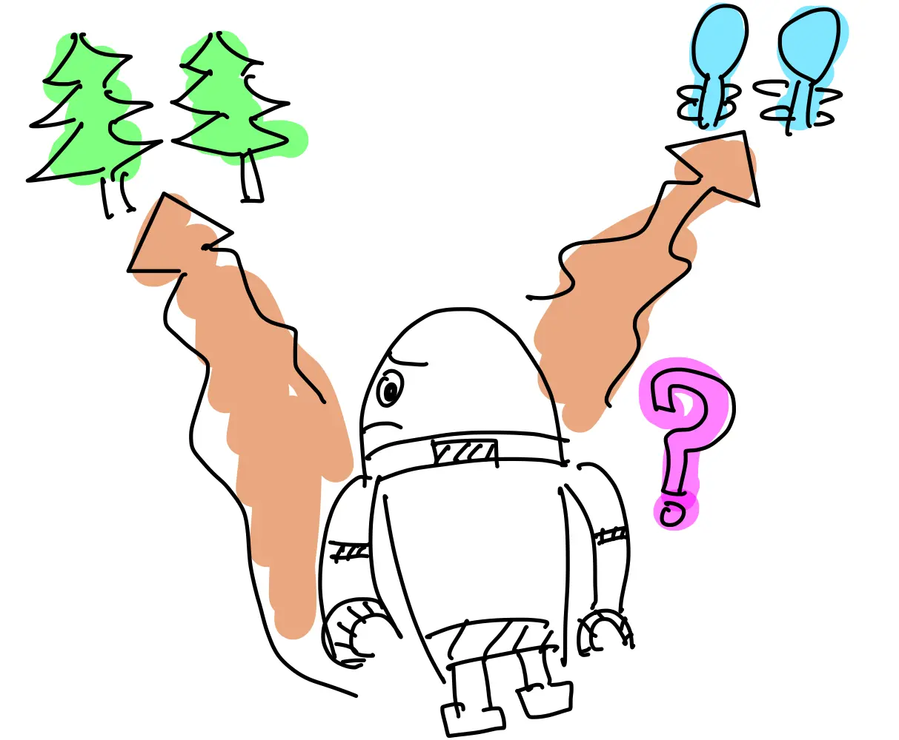

 

  

<h3 align="center">Online Graph Exploration Algorithms</h3>

  Implementation of online exploration algorithms for different graph classes

  
  
  

## What is online graph exploration?

Given a graph $G = (V, E)$ and a number of agents $k$. The agents are placed on the initial node $s \in V$, and they have no knowledge of the overall structure of the graph without $s$ and edges incident to $s$ (this derives the term "online").

The agents can move to adjacent nodes in the graph or stay in the current node. The goal is basically to visit all nodes in the graph and return to the initial node $s$. When an agent visit a unknown node, it gets information about the node and its neighbors.

This problem has variations depending on communication between agents, the goal of the exploration, and the objective of the exploration.

- Communication
  - (Global Communication) If one agent gets information, immediately all agents get the same information
  - (Local Communication) Agents can communicate when they are in the same node or get information from the node to read/write
- Goal of the exploration
  - All agents return to the initial node $s$ after visiting all nodes in the graph
  - Every node is visited by at least one agent (no need to return to the initial node)
- Objective of the exploration
  - (Time model) To minimize the time by which all agents return to the initial node $s$ after visiting all nodes in the graph.
  - (Energy model) To minimize the distance traveled by all agents to visit all nodes in the graph.

## Applications

- Rescue missions in disaster areas
- Cleaning robots
- Exploration of unknown environments

## In this repository

This repository contains the implementations of the following algorithms:

| Algorithm | Graph class    | Communication | Objective | Status              |
| --------- | -------------- | ------------- | --------- | ------------------- |
| BEER [1]  | Weighted Trees | Local         | Time      | 🟡 Work in Progress |
| GTE       | Grid Graph     | Local         | Time      | 🟢 ToDo             |

## Credits

This repository is based on the following papers:

- [1] [Online graph exploration algorithms for cycles and trees by multiple searchers](https://link.springer.com/article/10.1007/s10878-012-9571-y)

## License

Under the MIT License, see [LICENSE](/LICENSE).
